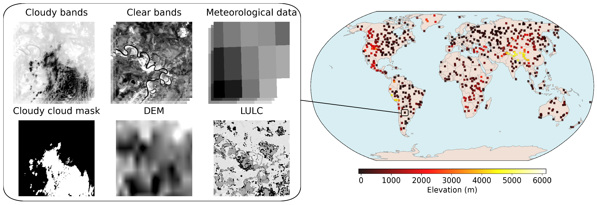

# [TIRAuxCloud: A Thermal Infrared Dataset for Day and Night Cloud Detection](https://arxiv.org/abs/2602.21905)

TIRAuxCloud is a multi-modal dataset designed to support **all day cloud segmentation**, with a particular focus on **thermal infrared (TIR) imagery**. It combines multispectral observations from **Landsat and VIIRS** with auxiliary information such as **elevation, land cover, meteorological variables, and cloud-free reference imagery**. The dataset includes both **automatically generated cloud masks and manually annotated samples**, enabling the development and evaluation of advanced cloud detection methods.

The full paper describing the dataset, methodology, and benchmarks is available on: https://arxiv.org/abs/2602.21905




---

## 📁 Download TIRAuxCloud

Inside the hugging face repository https://huggingface.co/datasets/tirauxcloud/TIRAuxCloud/tree/main the following are provided :

- Data from the **training, validation and test splits** of the three **TIRAuxCloud subsets**:
  - **Main Landsat**
  - **MA Landsat**
  - **VIIRS**

- Saved model weights used in the experiments presented in the paper (`model_files.tar.gz`)

---

## 🔁 Reproducing Model Metrics

To reproduce the evaluation results of any model:

### 1️⃣ Complete the configuration file  
Edit **`saved_model_run.json`** and fill in the correct configuration block for the selected subset `"landsat"`, `"landsatMA"` or `"viirs"`

Make sure that all the parameters in the selected configuration block of the provided **`saved_model_run.json`** are filled correctly. No additional parameters are required beyond those already provided in **`saved_model_run.json`**

- `"dataset_folder"` parameter  is the folder of the taining file lists (csv files that define which are the training, validation and test files)
- `"dataset_dir"` is the folder of the dataset files (image samples)
- `"device"`, `"cpuworkers"` and `"batch_size"`** can be adjusted to your system's specifications

All the other parameters in the JSON configuration must match the corresponding values in the relevant CSV row of the selected model. All saved models are in the hugging face repository.


### 2️⃣ Run the evaluation script  
Execute **`model_test.py`** with the `-t` parameter to select the test subset:

```bash
python model_test.py -t landsat
python model_test.py -t landsatMA
python model_test.py -t viirs
```

---

## 📖 Citation

if you use this work please cite:

```
@misc{apostolakis2026tirauxcloudthermalinfrareddataset,
      title={TIRAuxCloud: A Thermal Infrared Dataset for Day and Night Cloud Detection}, 
      author={Alexis Apostolakis and Vasileios Botsos and Niklas Wölki and Andrea Spichtinger and Nikolaos Ioannis Bountos and Ioannis Papoutsis and Panayiotis Tsanakas},
      year={2026},
      eprint={2602.21905},
      archivePrefix={arXiv},
      primaryClass={cs.CV},
      url={https://arxiv.org/abs/2602.21905}, 
}
```
